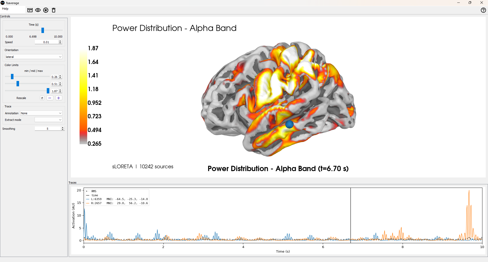

# EEG Brain Source Reconstruction Tool

Vibecoded. Do not use as medical tool. Could be all bs. Ask from 
AI what it thinks before using perhaps. Does not work with gamma frequencies 
due to Nyquist error. 

A simple GUI tool for visualizing EEG source reconstruction using MNE-Python. This tool helps visualize where
EEG signals might be coming from in the brain using standard computational methods.



## What This Tool Does

- **Loads EEG files** (EDF, BDF, FIF formats)
- **Reconstructs brain sources** using sLORETA inverse modeling
- **Visualizes results** on a 3D brain template
- **Analyzes different frequency bands** (Delta, Theta, Alpha, Beta, Gamma)
- **Shows various metrics** (Phase patterns, Power distribution, Raw signals)

## What This Tool Does NOT Do

❌ **This is not a medical device or brain scanner**  
❌ **This does not create real brain scans**  
❌ **This is not for medical diagnosis**  
❌ **Results are computational estimates, not medical imaging**

## How It Works

1. **Uses MNE-Python's fsaverage brain template** - a standard anatomical brain model
2. **Applies sLORETA source localization** - estimates where scalp EEG signals might originate
3. **Projects results onto brain surface** - visualizes estimated source activity
4. **Shows temporal evolution** - animate through time to see changes

## Technical Details

- **Forward modeling**: 3-layer head model (brain, skull, scalp)
- **Inverse solution**: sLORETA (standardized Low Resolution Electromagnetic Tomography)
- **Brain template**: MNE's fsaverage standard brain
- **Visualization**: 3D cortical surface mapping

## Requirements

```bash
pip install mne numpy scipy matplotlib tkinter
```

For 3D visualization (recommended):
```bash
pip install pyvista pyvistaqt
```

## Installation

1. Clone this repository
2. Install dependencies
3. Run the Python script

```bash
git clone https://github.com/anttiluode/EEGBrainSourceReconstructionTool
cd eeg-source-reconstruction
pip install -r requirements.txt
python eeg_source_reconstruction.py
```

## Usage

1. **Launch the application**
2. **Select frequency band** (e.g., Alpha for relaxed states)
3. **Choose visualization type** (Phase patterns, Power, or Raw signals)
4. **Load an EEG file** (multi-channel EEG data required)
5. **View 3D brain visualization** (if 3D backend available)

## File Requirements

- **Multi-channel EEG data** (minimum 4 channels with known positions)
- **Standard electrode names** (follows 10-20 system)
- **Supported formats**: EDF, BDF, FIF
- **Preprocessed data recommended** (filtered, artifact-free)

## Scientific Background

This tool implements standard EEG source localization methods used in neuroscience research:

- **sLORETA**: Standardized low-resolution brain electromagnetic tomography
- **Forward modeling**: Mathematical model of signal propagation from brain to scalp
- **Inverse problem**: Estimating brain sources from scalp measurements
- **fsaverage template**: Standard brain anatomy from FreeSurfer

## Limitations

⚠️ **Important Limitations:**
- Results are **estimates** based on mathematical modeling
- Requires **good quality EEG data** with proper electrode placement
- **Spatial resolution** is inherently limited compared to fMRI/MEG
- **Not validated for clinical use**
- Results depend on head model accuracy and data quality

## Educational Use

This tool is designed for:
- **Learning about EEG source localization**
- **Understanding brain signal processing**
- **Exploring neuroscience methods**
- **Research and education purposes**

## Contributing

Feel free to submit issues and pull requests. This is an educational tool, so contributions that improve understanding and usability are welcome.

## License

MIT License - Feel free to use for educational and research purposes.

## Acknowledgments

- **MNE-Python team** for the excellent neuroimaging toolkit
- **FreeSurfer team** for the fsaverage brain template
- **Neuroscience community** for developing these methods

## Disclaimer

This software is for educational and research purposes only. It is not intended for medical diagnosis or clinical decision-making. Always consult qualified medical professionals for any health-related concerns.
